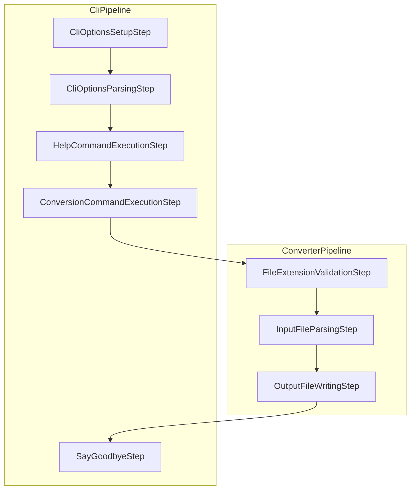
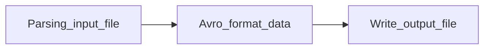

# YadConverter
Yet another data converter (YadConverter) is a simple Java CLI tool for converting data between CSV and Parquet formats.

---

## Table of Contents

- [Setup](#setup)
- [Usage](#usage)
- [Testing & Code Coverage](#testing--code-coverage)
- [Design](#design)
- [Dependencies](#dependencies)
- [Room for Improvement](#room-for-improvement)

---

## Setup

1. **Install Java 11**
2. **Install Maven**
3. **Windows users:**  
   Set the `%HADOOP_HOME%` environment variable.  
   See [cdarlint/winutils](https://github.com/cdarlint/winutils) for details.

## Usage

1. Navigate to the project root.
2. Compile the project:
   ```sh
   mvn package
   ```
3. Run the application:
   ```sh
   java -jar target/yad-converter.jar -i <input file path> -o <output file path>
   ```

---

## Testing & Code Coverage

- Run tests:
  ```sh
  mvn test
  ```
- After running tests, a `jacoco.exec` file will be generated in the `target` folder.
- To generate an HTML coverage report:
  1. [Download JaCoCo](https://www.jacoco.org/jacoco/) and extract it (e.g., to a `jacoco` directory).
  2. Locate `jacococli.jar` in `jacoco/lib/`.
  3. Run the following command from the JaCoCo directory:
     ```sh
     java -jar lib/jacococli.jar report path/to/jacoco.exec --classfiles path/to/your.jar --html path/for/report
     ```
  4. Open `index.html` in the generated report directory to view the coverage.

  > Reference: [StackOverflow answer](https://stackoverflow.com/a/55398682)

 ***Current code branch coverage is 91%***

---

## Design

### Pipelines

The tool is structured around two main pipelines:

- **[CliPipeline](src/main/java/cli/pipeline/CliPipeline.java):** Manages command-line interactions and output display.
- **[ConverterPipeline](src/main/java/cli/converter/ConverterPipeline.java):** Handles the conversion process from the input file to the output file.



### Conversion Flow

The conversion process follows these steps:


Implementations of `InputFileParser` and `OutputFileWriter` are designed to support extensibility for different file formats. These implementations can be registered with the system using the `FileParserRegistry` and `FileWriterRegistry` classes. 

- **Registration:**  
  Custom parsers and writers for new file types (e.g., JSON, XML) can be added by implementing the respective interfaces and registering them with the appropriate registry. This enables the converter to recognize and process additional formats without modifying the core logic.

- **Retrieval:**  
  During the conversion process, the system queries the registries to retrieve the appropriate parser or writer based on the file extension or format. This decouples the conversion logic from specific file implementations and makes the architecture modular and easy to extend.

This registry-based approach allows YadConverter to be easily adapted for future requirements and new data formats.

---

## Dependencies

This project is built with Java 11 and leverages the following libraries:

| Library                | Description                                                                                   |
|------------------------|-----------------------------------------------------------------------------------------------|
| **Apache Commons CSV** | Reads and writes files in various CSV (Comma Separated Values) formats.                       |
| **Apache Parquet**     | Enables efficient reading and writing of Parquet files.                                       |
| **Apache Avro**        | Provides schema definition and acts as a common data serialization framework.                 |
| **Hadoop Common**      | Supplies core I/O and filesystem support, required for Parquet integration.                   |
| **Hadoop Client API**  | Offers APIs for local filesystem operations, especially when working with Parquet files.      |
| **JUnit Jupiter**      | Framework for writing and running unit tests.                                                 |
| **JaCoCo**             | Generates code coverage reports for test suites.                                              |

---

## Room for Improvement

- Allow file configuration:
  - CSV delimiter
  - Parquet row group size
- Option to overwrite output files
- Show progress during conversion
- Integrate logging
- Performance improvements for large files:
  - Chunk processing
  - Consider using [Apache Spark](https://spark.apache.org/) for DataFrame-based processing
- Support additional conversion types

---